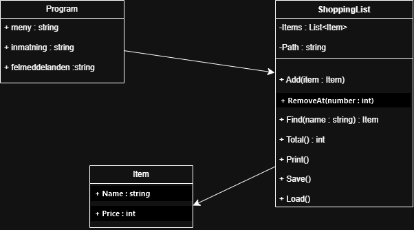

# Kunskapskontroll 2 – Robust inköpslista
Detta är min lösning på Kunskapskontroll 2 där jag bygger en robust inköpslista i C#.

## Del 1 – Felrapport

1. **Text i menyn kunde krascha programmet.** Menyvalet lästes med `int.Parse`. Text i stället för ett tal gav `FormatException`. Jag använder `int.TryParse` och visar ett meddelande.
2. **Text i priset kunde krascha programmet.** Priset lästes också med `int.Parse`, vilket gav `FormatException` för text. Jag använder `int.TryParse`.
3. **Fel nummer vid borttagning kunde krascha programmet.** `int.Parse` kunde krascha på text och `RemoveAt` kunde krascha om numret inte fanns. Jag använder `int.TryParse` och kontrollerar numrets gränser.
4. **Programmet kunde krascha när listfilen saknades eller innehöll en tom eller felaktig rad.** `Load()` läste filen utan att hantera filfel och använde delar av en rad utan att först kontrollera att de fanns. Jag kontrollerar filen, raderna och priset innan varan läggs till.
5. **Totalsumman blev fel.** Summeringen började på index 1 och missade den första varan. Den börjar nu på index 0.
6. **Ett sparfel doldes.** `Save()` hade en tom `catch` och skrev sedan ändå att listan sparats. Jag fångar specifika filfel och visar ett felmeddelande i stället för att säga att sparningen lyckades.

## Del 2 – Robusthet och designval

`Item` avvisar ett tomt namn med `ArgumentException` och ett negativt pris med `ArgumentOutOfRangeException`. Programmet fångar dessa undantag, visar ett begripligt meddelande och fortsätter till nästa menyvarv.

Inköpslistans budgettak är 1 000 kr. `ShoppingList.Add()` kastar `InvalidOperationException` om varan skulle överskrida taket. Jag valde ett undantag eftersom det innebär att operationen inte kan genomföras; då kan anroparen fånga det och visa varför varan inte lades till. Listans aktuella summa kontrolleras innan varan läggs till.

Sparning och inläsning hanterar specifika filundantag och meddelar användaren om filen inte kan nås. Programmet meddelar inte att sparningen lyckades när skrivningen misslyckas.

## Klassdiagram

## Kontrollista

- `dotnet build` lyckades utan fel.
- Programmet startades och avslutades via menyvalet.
- Källkoden använder `TryParse` för menyval, pris och borttagningsnummer.
- `.gitignore` ignorerar `bin/` och `obj/`.
