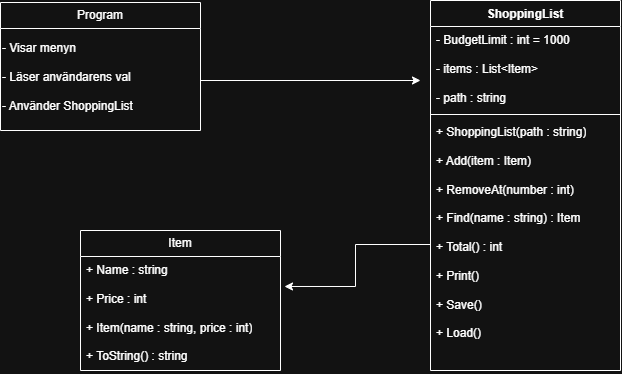

# Kunskapskontroll 2 – Robust inköpslista

## Del 1 – Felrapport

1. **Text i menyn kunde krascha programmet.** Om jag skrev text i stället för ett menyval kunde programmet få ett `FormatException`. Jag ändrade därför inläsningen till `int.TryParse` och lade till ett felmeddelande.
2. **Text i priset kunde krascha programmet.** Samma problem fanns när priset lästes in. Jag använder `int.TryParse` även där, så felaktig inmatning inte kraschar programmet.
3. **Fel nummer vid borttagning kunde krascha programmet.** Ogiltig text eller ett nummer som inte fanns kunde orsaka fel. Jag kontrollerar inmatningen och numrets gränser innan jag tar bort en vara.
4. **Problem med listfilen kunde krascha programmet.** Jag lade till felhantering för filen och kontrollerar raderna innan varor läggs till. Tomma eller felaktiga rader hoppas över.
5. **Totalsumman blev fel.** Summeringen missade den första varan. Jag ändrade den så att den räknar från listans första index.
6. **Ett sparfel kunde döljas.** Programmet kunde säga att listan sparats trots att sparningen misslyckats. Jag ändrade felhanteringen så att användaren får ett felmeddelande i stället.

## Del 2 – Robusthet och designval

- Jag låter `Item` avvisa tomma namn med `ArgumentException` och negativa priser med `ArgumentOutOfRangeException`.
- Jag fångar undantagen och visar ett begripligt felmeddelande i programmet.
- Jag satte budgettaket till 1 000 kr. Om en vara skulle överskrida gränsen avbryts tillägget och ett felmeddelande visas.
- Jag lade till felhantering vid sparning och inläsning av fil. Om en sparad fil saknas startar programmet med en tom lista.

## Klassdiagram

## Kontrollista

- `dotnet build` fungerade utan fel.
- Programmet kördes via menyval.
- Källkoden använder `TryParse` för menyval, pris och borttagningsnummer.
- `.gitignore` ignorerar `bin/` och `obj/`.
